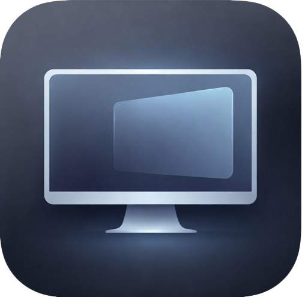

# Monitra Virtual Display Manager

[Turkish version below / Türkçe versiyonu aşağıdadır]

Monitra Virtual is a lightweight macOS utility that allows you to create virtual displays and mirror them in a window. This is particularly useful for screen sharing, recording, or expanding your workspace without physical monitors.



## Features

- **Virtual Display Creation**: Create HiDPI virtual displays with a single click.
- **Windowed Mirroring**: View your virtual display in a resizable, floating window.
- **Window Snapping**: Quickly snap mirror windows to the left or right side of your screen.
- **Privacy Focused**: Lightweight, no tracking, and open source.
- **Native Experience**: Built with Swift and native macOS APIs (CoreGraphics, CoreDisplay).

## Installation

### Pre-built (Recommended)
1. Download the latest **Monitra Virtual.dmg** from the [Releases](https://github.com/furkanolkay/monitradisplay/releases) page.
2. Open the DMG and drag **Monitra Virtual** to your Applications folder.

### From Source
1. Clone the repository:
   ```bash
   git clone https://github.com/furkanolkay/monitradisplay.git
   cd monitradisplay/VirtualScreen
   ```
2. Build the application:
   ```bash
   make
   ```
3. Run the application:
   ```bash
   open build/Monitra\ Virtual.app
   ```

### Troubleshooting
If you encounter a black screen in the mirror window, macOS might be blocking Screen Recording permissions:
1. Go to **System Settings > Privacy & Security > Screen Recording**.
2. Remove **Monitra Virtual** if it exists.
3. Restart the app and grant permissions when prompted.

## Development

- **Language**: Swift
- **UI Framework**: AppKit (Cocoa)
- **Graphics**: CoreGraphics, Private Frameworks (for virtual display)

---

# Monitra Sanal Ekran Yöneticisi

Monitra Virtual, sanal ekranlar oluşturmanıza ve bunları bir pencere içinde yansıtmanıza olanak tanıyan hafif bir macOS aracıdır. Özellikle ekran paylaşımı, kayıt yapma veya fiziksel monitör olmadan çalışma alanınızı genişletmek için kullanışlıdır.

## Özellikler

- **Sanal Ekran Oluşturma**: Tek tıkla HiDPI sanal ekranlar oluşturun.
- **Pencere Yansıtma**: Sanal ekranınızı yeniden boyutlandırılabilir, yüzen bir pencerede görün.
- **Pencere Yaslama**: Yansıma pencerelerini ekranınızın soluna veya sağına hızla yaslayın.
- **Gizlilik Odaklı**: Hafif, takip içermez ve açık kaynaklıdır.
- **Yerel Deneyim**: Swift ve yerel macOS API'leri (CoreGraphics, CoreDisplay) ile oluşturulmuştur.

## Kurulum

### Hazır Sürüm (Önerilen)
1. [Releases](https://github.com/furkanolkay/monitradisplay/releases) sayfasından en son **Monitra Virtual.dmg** dosyasını indirin.
2. DMG dosyasını açın ve **Monitra Virtual** simgesini Uygulamalar (Applications) klasörüne sürükleyin.

### Kaynak Koddan
1. Depoyu kopyalayın:
   ```bash
   git clone https://github.com/furkanolkay/monitradisplay.git
   cd monitradisplay/VirtualScreen
   ```
2. Uygulamayı derleyin:
   ```bash
   make
   ```
3. Uygulamayı çalıştırın:
   ```bash
   open build/Monitra\ Virtual.app
   ```

### Sorun Giderme
Yansıma penceresinde siyah bir ekran görürseniz, macOS Ekran Kaydı izinlerini engelliyor olabilir:
1. **Sistem Ayarları > Gizlilik ve Güvenlik > Ekran Kaydı** bölümüne gidin.
2. Varsa **Monitra Virtual**'ı kaldırın.
3. Uygulamayı yeniden başlatın ve sorulduğunda izinleri verin.

## Lisans / License

MIT
